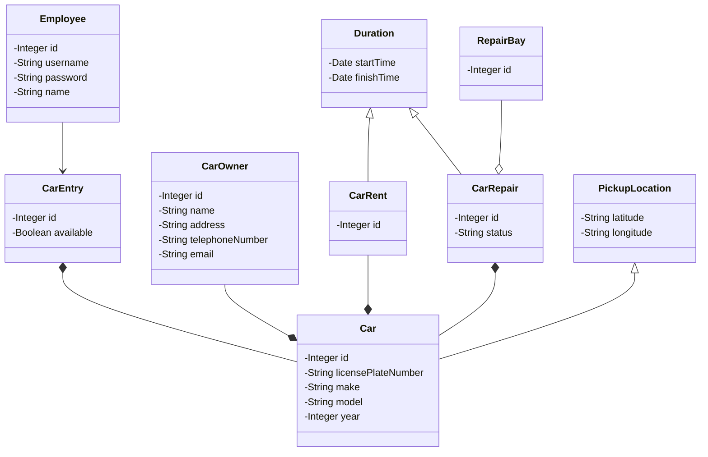

# Enterprise System Integration 2022

## Environment variables

 - `SPRING_DATASOURCE_URL=jdbc:postgresql://localhost:5432/postgres`
 - `SPRING_DATASOURCE_USER=postgres`
 - `SPRING_DATASOURCE_PASS=postgres`
 - `SECURITY_SECRET_KEY=adilsdeals`

## Run locally

```bash
cp .env.example .env
# replace environment variables
docker-compose -f docker-compose.local.yml up
```

# Checkpoint 1 Report

#### Team L

##### Bill Sendewicz
##### Mir Jalal Hashimli
##### Adil Shirinov
##### Volodymyr Chernetskyi

GitHub repo: https://github.com/Stackeduary/Enterprise-System-Integration-2022

Deployed app: https://api.chernetskyi.com

<br>

## Data Entities



<br>

## REST API

URI | HTTP Verb | Description
---|---|---
 /car/create | POST | add a car
 /car/{carId} | GET | view a car with a specified ID
 /car | GET | view all cars
 /car/{carId} | PUT | edit a specific car's attributes
 /car/{carId} | DELETE | remove a specific car
 /car-owner/create | POST | add a car owner
 /car-owner/{carId} | GET | view a car owner with a specified ID
 /car-owner/ | GET | view all car owners
 /car-owner/{carId} | PUT | edit a specific car owner's attributes
 /car-owner/{carId} | DELETE | remove a specific car owner
 /cars/rent/create | POST | add a rental
 /cars/rent/{id} | GET | view a rental with a specified ID
 /cars/rent | GET | view all rentals
 /cars/rent/{id} | PUT | edit a specific rental's attributes
 /cars/rent/{id} | DELETE | remove a specific rental
 /cars/repair/create | POST | add a repair reservation
 /cars/repair/{id} | GET | view a repair reservation with a specified ID
 /cars/repair | GET | view all repair reservations
 /cars/repair/{id} | PUT | edit a specific repair reservation's attributes
 /cars/repair/{id} | DELETE | remove a specific repair reservation 

<br>

## Security Aspects

Role | Description
---|---
 employee | can perform CRUD operations on all cars, car owners, repair reservations and rental reservations

